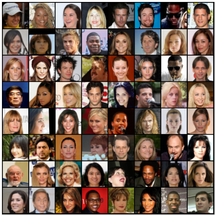
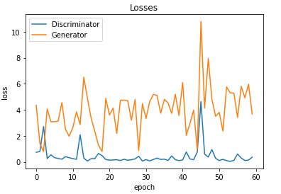
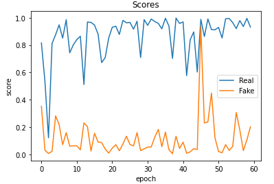

# DC GAN Paper Implementation
I try to make the implementation as simple as possible. 

## Dataset
Celebrities Images 100k of 128x128. Dataset from [Kaggle Celebrities Dataset](https://www.kaggle.com/greg115/celebrities-100k)
Dataset sample:



### Training
Trained for 60 epochs with the parameters are in given notebook. Some changes are made in generator and discriminator architecture to generate the realistic output. 
You can directly use this [Kaggle NoteBook](https://www.kaggle.com/sushant097/celebrity-face-generation)

## Output
Trained for 60 epochs in the Kaggle Celebrities Dataset. 


Output:


### Loss:


### Scores:


## DC GAN Paper

Unsupervised Representation Learning with Deep Convolutional Generative Adversarial Networks by Alec Radford, Luke Metz, Soumith Chintala

### Abstract
In recent years, supervised learning with convolutional networks (CNNs) has seen huge adoption in computer vision applications. Comparatively, unsupervised learning with CNNs has received less attention. In this work we hope to help bridge the gap between the success of CNNs for supervised learning and unsupervised learning. We introduce a class of CNNs called deep convolutional generative adversarial networks (DCGANs), that have certain architectural constraints, and demonstrate that they are a strong candidate for unsupervised learning. Training on various image datasets, we show convincing evidence that our deep convolutional adversarial pair learns a hierarchy of representations from object parts to scenes in both the generator and discriminator. Additionally, we use the learned features for novel tasks - demonstrating their applicability as general image representations.


```bash
@misc{radford2016unsupervised,
      title={Unsupervised Representation Learning with Deep Convolutional Generative Adversarial Networks}, 
      author={Alec Radford and Luke Metz and Soumith Chintala},
      year={2016},
      eprint={1511.06434},
      archivePrefix={arXiv},
      primaryClass={cs.LG}
}

```