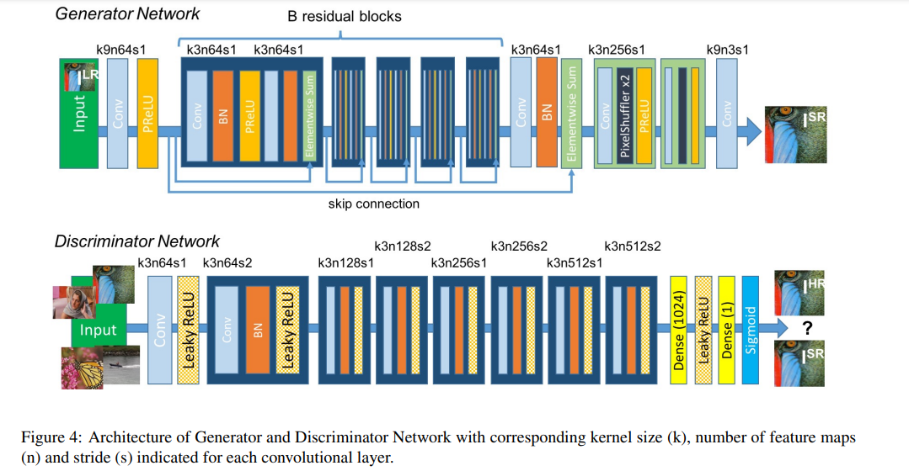

# SRGAN Implemenation
I try to make the implementation as simple as possible. 

### Architecture


### To train
- make cetain changes in `config.py`
- train using `train.py`

# Abstract
Photo-Realistic Single Image Super-Resolution Using a Generative Adversarial Network

```bash
@misc{ledig2016photorealistic,
    title={Photo-Realistic Single Image Super-Resolution Using a Generative Adversarial Network},
    author={Christian Ledig and Lucas Theis and Ferenc Huszar and Jose Caballero and Andrew Cunningham and Alejandro Acosta and Andrew Aitken and Alykhan Tejani and Johannes Totz and Zehan Wang and Wenzhe Shi},
    year={2016},
    eprint={1609.04802},
    archivePrefix={arXiv},
    primaryClass={cs.CV}
}
```

Research Papper [Arxiv]: https://arxiv.org/abs/1609.04802 

Full Annotated Paper & Summary [By Me]: https://github.com/sushant097/annotated_research_papers/blob/master/GANs/SRGAN-2017.pdf 

For other annotated GAN paper & Summary: https://github.com/sushant097/30-Days-GANs-Paper-Reading