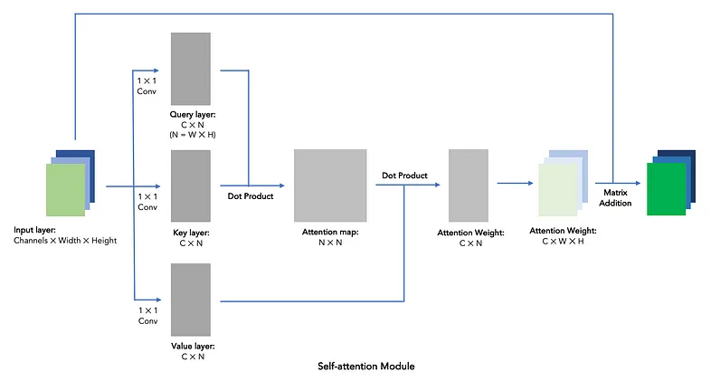

# Self Attention GAN Implementation
Simple scratch implementation of Self-Attention GAN for MNIST digit dataset (28x28) size. Self-attention layers work by calculating multiple matrix dot products, which would contribute to a 10% ~ 30% longer training times depending on your specific model structure.

However, in the [SAGAN paper (Han et al. 2018)](https://arxiv.org/abs/1805.08318), the author did report getting better inception and FID scores with self-attention modules. My next step would be to adopt either one of these metrics, and see if Self-attention GAN is bringing better performance. 

### Self-attention module:
It works as follows: 



1. Using a kernel size 1 convo to generate Query, Key and Value layers, with the shape of Channels * N, N = Width * Height.

2. Generate attention map by the matrix dot product of Query and Key, with the shape of N * N. The N * N attention map describe each pixel's attention score on every other pixels, hence the name "self-attention". Pixels here mean data points in input matrices.

3. Get attention weights by the matrix dot product of Value and attention map, with the shape of C * N. The attention weights describe each pixel's total attention score throughout all pixels. We then reshape the attention weights into C * W * H.

4. Add the attention weights back onto input layer it self with a weight of Gamma, a learning parameter initializing at 0. It means that the self-attention module does not do anything initially.

Spectral Normalization module borrowed from :  https://github.com/heykeetae/Self-Attention-GAN 

### Abstract
In this paper, we propose the Self-Attention Generative Adversarial Network (SAGAN) which allows attention-driven, long-range dependency modeling for image generation tasks. Traditional convolutional GANs generate high-resolution details as a function of only spatially local points in lower-resolution feature maps. In SAGAN, details can be generated using cues from all feature locations. Moreover, the discriminator can check that highly detailed features in distant portions of the image are consistent with each other. Furthermore, recent work has shown that generator conditioning affects GAN performance. Leveraging this insight, we apply spectral normalization to the GAN generator and find that this improves training dynamics. The proposed SAGAN achieves the state-of-the-art results, boosting the best published Inception score from 36.8 to 52.52 and reducing Frechet Inception distance from 27.62 to 18.65 on the challenging ImageNet dataset. Visualization of the attention layers shows that the generator leverages neighborhoods that correspond to object shapes rather than local regions of fixed shape.
 
```
@article{Zhang2018SelfAttentionGA,
    title={Self-Attention Generative Adversarial Networks},
    author={Han Zhang and Ian J. Goodfellow and Dimitris N. Metaxas and Augustus Odena},
    journal={CoRR},
    year={2018},
    volume={abs/1805.08318}

}
```

