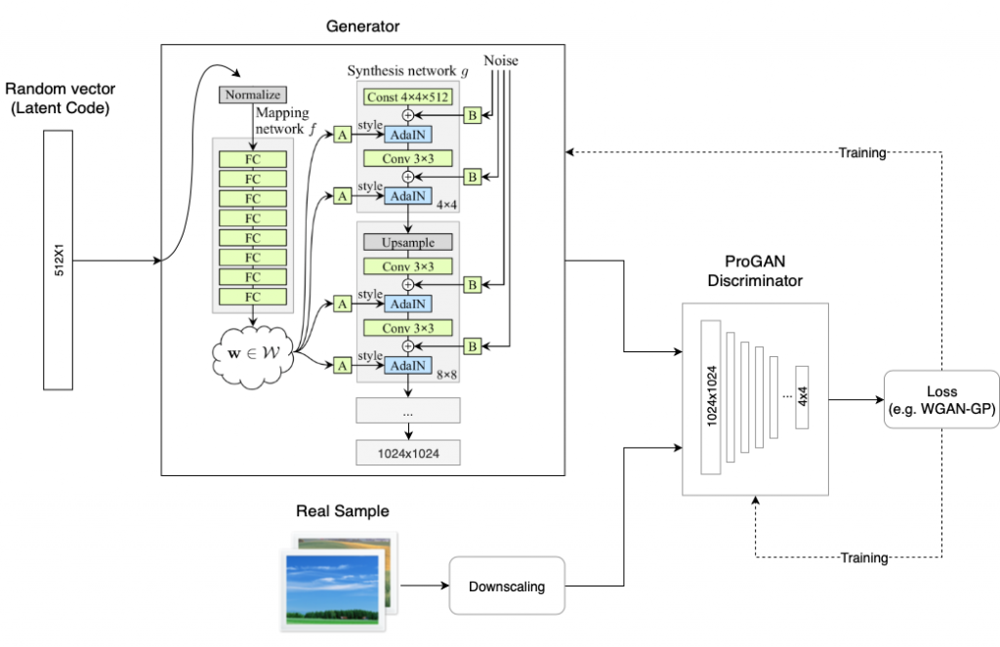
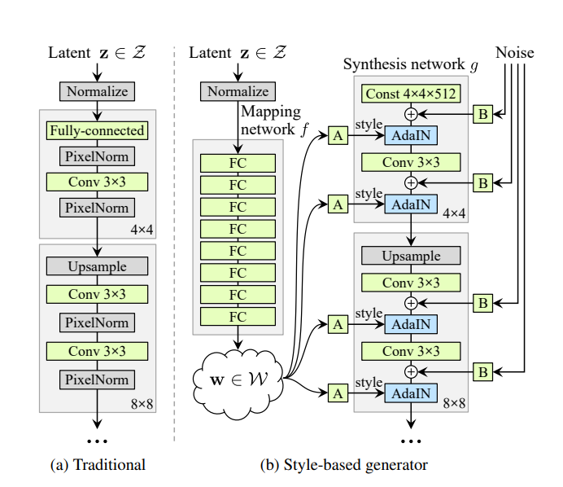

# Style GAN Implementation in Pytorch
#### Simple and readable implementation of StyleGAN in PyTorch.
I try to make simple implementation and as similar to official implementation.

**[Part of 30 Day GAN paper Reading Challenge](https://github.com/sushant097/30-Days-GANs-Paper-Reading)**

**Training - Implementation Going!**

#### StyleGAN architecture

StyleGAN Architecture            |  Generator Architecture
:-------------------------:|:-------------------------:
 |  


Want to know more on StyleGAN, see : **[Style GAN Annotated Paper & Summary](https://github.com/sushant097/annotated_research_papers/blob/master/GANs/StyleGAN-2018.pdf)**


### StyleGan Paper - CVPR-2019
A Style-Based Generator Architecture for Generative Adversarial Networks by Tero Karras, Samuli Laine, Timo Aila.

#### Abstract
We propose an alternative generator architecture for generative adversarial networks, borrowing from style transfer literature. The new architecture leads to an automatically learned, unsupervised separation of high-level attributes (e.g., pose and identity when trained on human faces) and stochastic variation in the generated images (e.g., freckles, hair), and it enables intuitive, scale-specific control of the synthesis. The new generator improves the state-of-the-art in terms of traditional distribution quality metrics, leads to demonstrably better interpolation properties, and also better disentangles the latent factors of variation. To quantify interpolation quality and disentanglement, we propose two new, automated methods that are applicable to any generator architecture. Finally, we introduce a new, highly varied and high-quality dataset of human faces.

```bash
@misc{karras2019stylebased,
      title={A Style-Based Generator Architecture for Generative Adversarial Networks}, 
      author={Tero Karras and Samuli Laine and Timo Aila},
      year={2019},
      eprint={1812.04948},
      archivePrefix={arXiv},
      primaryClass={cs.NE}
}
```