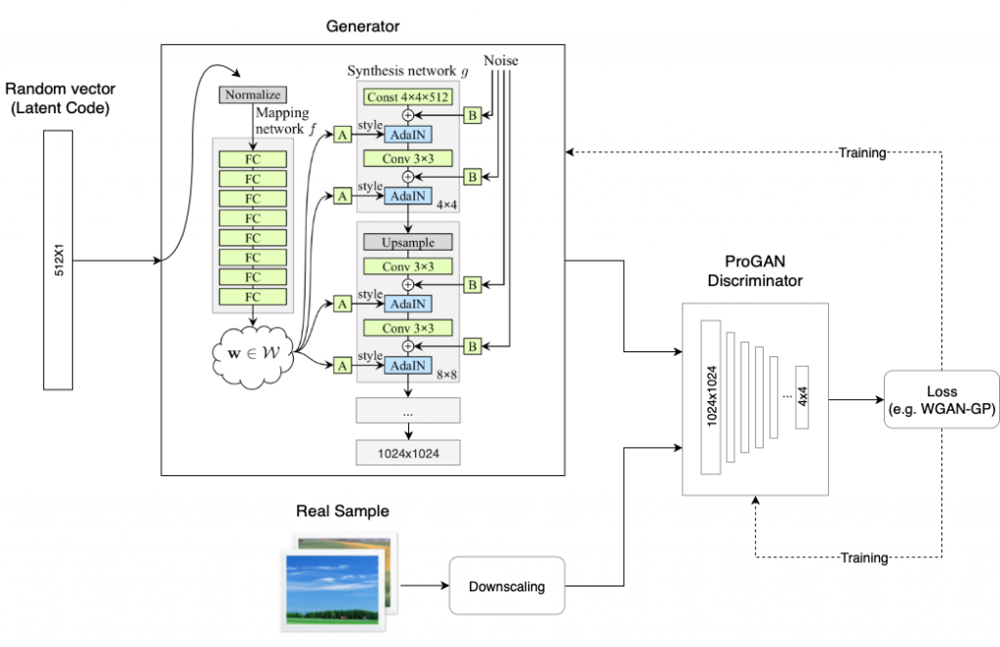
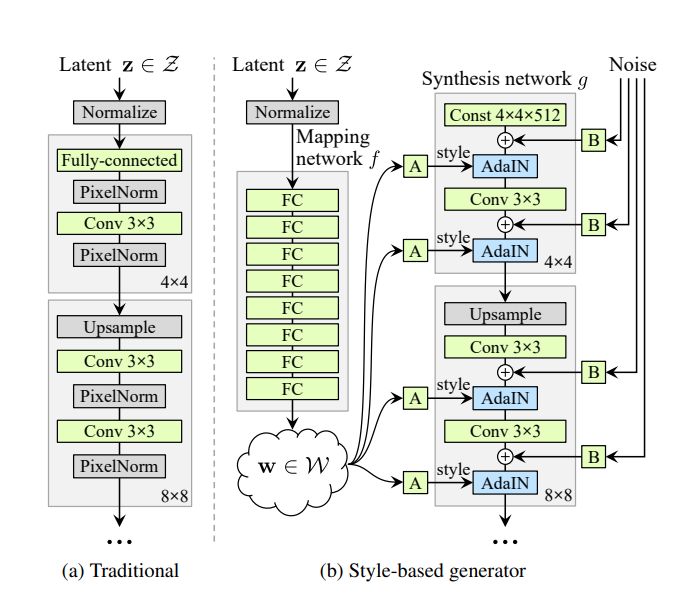

# Style GAN Implementation in Pytorch
#### Simple and readable implementation of StyleGAN in PyTorch.
I try to make simple implementation and as similar to official implementation.

**[Part of 30 Day GAN paper Reading Challenge](https://github.com/sushant097/30-Days-GANs-Paper-Reading)**

**Training - Implementation Going!**

#### StyleGAN architecture

StyleGAN Architecture            |  Generator Architecture
:-------------------------:|:-------------------------:
 |  


Want to know more on StyleGAN, see : **[Style GAN Annotated Paper & Summary](https://github.com/sushant097/annotated_research_papers/blob/master/GANs/StyleGAN-2018.pdf)**


### StyleGan2 Paper - CVPR-2020
Analyzing and Improving the Image Quality of StyleGAN by Tero Karras, Samuli Laine, Timo Aila.

#### Abstract
The style-based GAN architecture (StyleGAN) yields state-of-the-art results in data-driven unconditional generative image modeling. We expose and analyze several of its characteristic artifacts, and propose changes in both model architecture and training methods to address them. In particular, we redesign the generator normalization, revisit progressive growing, and regularize the generator to encourage good conditioning in the mapping from latent codes to images. In addition to improving image quality, this path length regularizer yields the additional benefit that the generator becomes significantly easier to invert. This makes it possible to reliably attribute a generated image to a particular network. We furthermore visualize how well the generator utilizes its output resolution, and identify a capacity problem, motivating us to train larger models for additional quality improvements. Overall, our improved model redefines the state of the art in unconditional image modeling, both in terms of existing distribution quality metrics as well as perceived image quality.

```bash
@misc{
  title = {Analyzing and Improving the Image Quality of StyleGAN},
  author = {Karras, Tero and Laine, Samuli and Aittala, Miika and Hellsten, Janne and Lehtinen, Jaakko and Aila, Timo},  
  publisher = {arXiv},
  year = {2020},
}
```