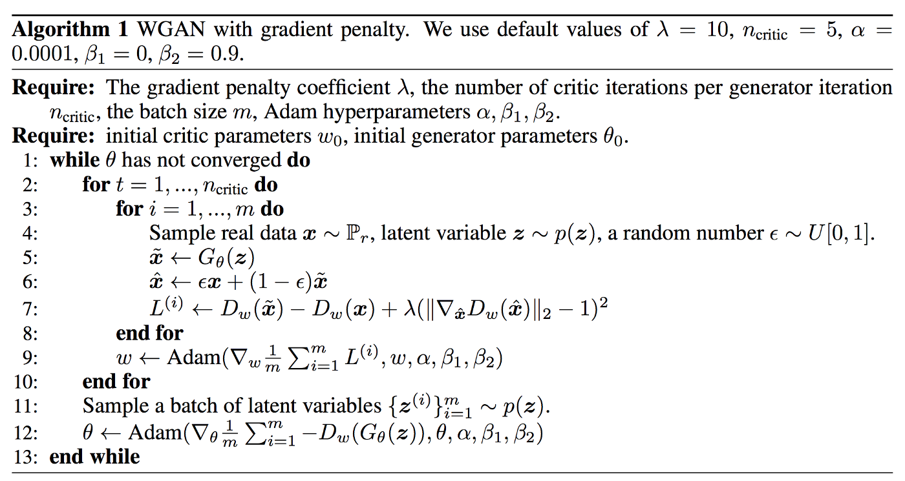

# WGANGP Implemenation
I try to make the implementation as simple as possible. 


## Dataset 
- CIFAR10

## Why we need WGANGP i.e WGAN with Gradient Penalty 
Straightforward answer is WGANGP improves the problem of WGAN.
The main drawback of WGAN is it perform Weight Clipping to maintain critic gradients within the [-c,  c] range to satisfy lipschitz constraint.
> As, Weight clipping is a clearly terrible way to enforce a lipschitz constraint. If the clipping parameter is large, then it can take a long time for any weights to reach their limit, thereby making it harder 
to train the critic till optimality. - From Original WGAN Paper

That's the main reason WGANGP is introduced that uses gradient penalty instead to weight clipping to satisfy lipschitz constraint.

Some major Changes in WGANGP compare to WGAN are:
* Weight Clipping is replaced by Gradient Penalty that improves convergence and training stability. Gradient penalty adds computational complexity that may not be desirable but it does produce some higher-quality images.
* RMSProp is replaced by Adam Optimizer with betas = (0.0, 0.9)
* Learning rate is increased from 5e-5 to 1e-4. (Not big change though)
* Batch normalization is avoided for the critic (discriminator) and replaced by InstanceNorm. It impacts the effectiveness of the gradient penalty which is confirmed by experiments.

For more detail see **[Annotated WGANGP paper and Summary](https://github.com/sushant097/annotated_research_papers/blob/master/GANs/WGAN-GP-2017.pdf) by me.**


### WGANGP main algorithm


# WGANGP: Improved Training of Wasserstein GANs (NIPS 2017)

# Abstract
Generative Adversarial Networks (GANs) are powerful generative models, but suffer from training instability. The recently proposed Wasserstein GAN (WGAN) makes progress toward stable training of GANs, but sometimes can still generate only low-quality samples or fail to converge. We find that these problems are often due to the use of weight clipping in WGAN to enforce a Lipschitz constraint on the critic, which can lead to undesired behavior. We propose an alternative to clipping weights: penalize the norm of gradient of the critic with respect to its input. Our proposed method performs better than standard WGAN and enables stable training of a wide variety of GAN architectures with almost no hyperparameter tuning, including 101-layer ResNets and language models over discrete data. We also achieve high quality generations on CIFAR-10 and LSUN bedrooms.

```bash
@misc{gulrajani2017improved,
      title={Improved Training of Wasserstein GANs}, 
      author={Ishaan Gulrajani and Faruk Ahmed and Martin Arjovsky and Vincent Dumoulin and Aaron Courville},
      year={2017},
      eprint={1704.00028},
      archivePrefix={arXiv},
      primaryClass={cs.LG}
}
```