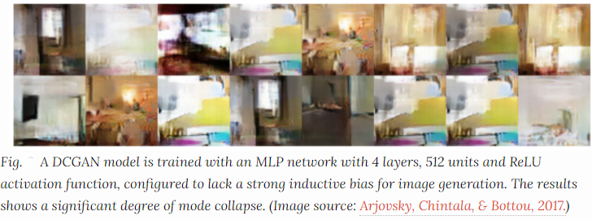

# WGAN Implemenation
I try to make the implementation as simple as possible. 


## Dataset
- CIFAR10

### Why we need WGAN Loss since GAN uses Jensen-Shannon(JS) divergence:
The main problems in GANs are:
1. **Hard to achieve Nash equilibrium :** Two models are trained simultaneously in a minimax game, however each model updates its costs independently with no respect to another player in the game. Updating the gradient of both models concurrently cannot guarantee a convergence.

2. **Vanishing Gradients:** When the discriminator is perfect, we are guaranteed with `D(x)=1` for real and `D(x)=0` for fake. Therefore the loss function L falls to zero and we end up with no gradient to update the loss during learning iterations
 

3. **Mode collapse**: During the training, the generator may collapse to a setting where it always produces same outputs.

4. and so on

So, to overcome this problem WGAN is introduced to help stabilize and improve the training of GANs. It uses Wasserstein distance which is better than Jensen-Shannon(JS) divergence.

### WGAN main algorithm


For more details see **[Annotated WGAN paper and Summary](https://github.com/sushant097/annotated_research_papers/blob/master/GANs/WassersteinGAN-2017.pdf) by me.**


# WGAN: Wasserstein GAN (ICLR 2017)

# Abstract
We introduce a new algorithm named WGAN, an alternative to traditional GAN training. In this new model, we show that we can improve the stability of learning, get rid of problems like mode collapse, and provide meaningful learning curves useful for debugging and hyperparameter searches. Furthermore, we show that the corresponding optimization problem is sound, and provide extensive theoretical work highlighting the deep connections to other distances between distributions.

```bash
@misc{arjovsky2017wasserstein,
      title={Wasserstein GAN}, 
      author={Martin Arjovsky and Soumith Chintala and Léon Bottou},
      year={2017},
      eprint={1701.07875},
      archivePrefix={arXiv},
      primaryClass={stat.ML}
}
```