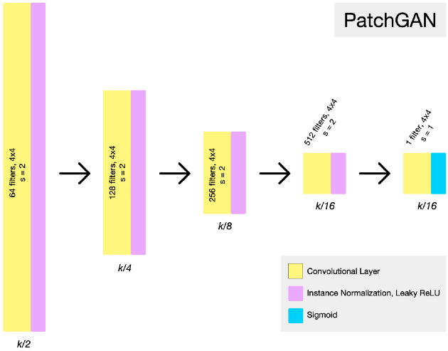
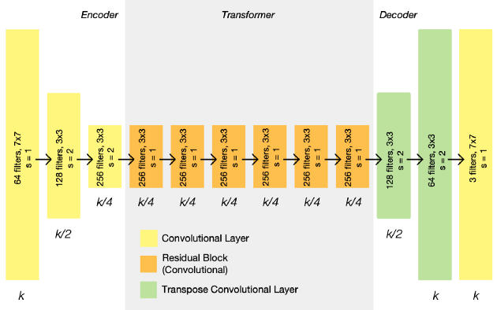
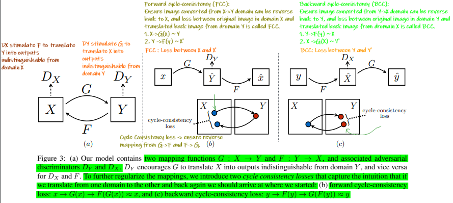

# Cycle GAN

Simple Implementation of Cycle GAN.

### Horses and Zebras Dataset
The dataset can be downloaded from Kaggle: [link](https://www.kaggle.com/suyashdamle/cyclegan).

### Training
Edit the config.py file to match the setup you want to use. Then run train.py

#### Discriminator Architecture


#### Generator Architecture



#### Annotated CycleGAN Paper - By Me

[Annotated Cycle GAN Paper](https://github.com/sushant097/annotated_research_papers/blob/master/GANs/cycleGAN-2017.pdf)

## CycleGAN paper
Unpaired Image-to-Image Translation using Cycle-Consistent Adversarial Networks by Jun-Yan Zhu, Taesung Park, Phillip Isola, Alexei A. Efros

#### Abstract
Image-to-image translation is a class of vision and graphics problems where the goal is to learn the mapping between an input image and an output image using a training set of aligned image pairs. 
However, for many tasks, paired training data will not be available. We present an approach for learning to translate an image from a source domain X to a target domain Y in the absence of paired examples. Our goal is to learn a mapping G:X→Y such that the distribution of images from G(X) is indistinguishable from the distribution Y using an adversarial loss. Because this mapping is highly under-constrained, we couple it with an inverse mapping F:Y→X and introduce a cycle consistency loss to push F(G(X))≈X (and vice versa).
Qualitative results are presented on several tasks where paired training data does not exist, including collection style transfer, object transfiguration, season transfer, photo enhancement, etc. Quantitative comparisons against several prior methods demonstrate the superiority of our approach.

```bash
@misc{zhu2020unpaired,
      title={Unpaired Image-to-Image Translation using Cycle-Consistent Adversarial Networks}, 
      author={Jun-Yan Zhu and Taesung Park and Phillip Isola and Alexei A. Efros},
      year={2020},
      eprint={1703.10593},
      archivePrefix={arXiv},
      primaryClass={cs.CV}
}
```