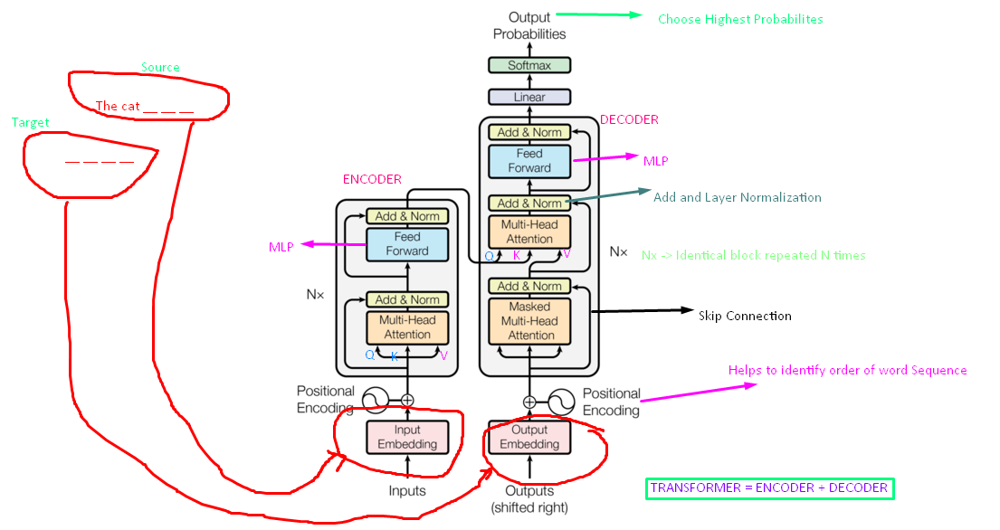
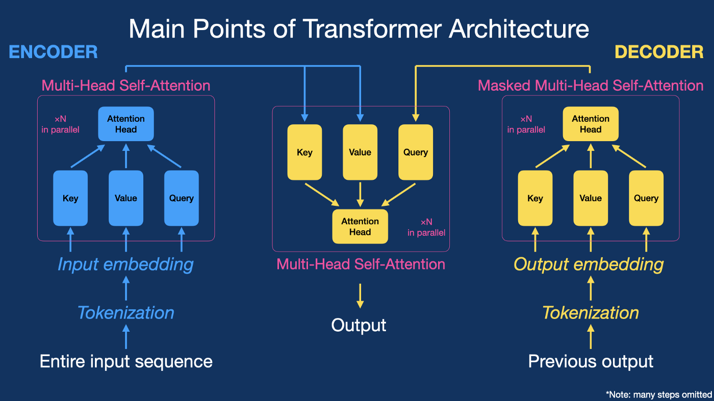

# Tranformer Scratch Implementation In PyTorch

This is the scratch Implementation of the Paper "Attention All You Need, 2017".

Why do we need a transformer even though we have RNN?

The main problem with the RNN (LSTM, GRU) is that we have to wait for the processing of the nth input until the (n-1)th input is processed, i.e., there is no possible parallel processing. So, the author of "Attention All You Need" says that we do not need RNN any more, we only need attention. Not sequential like RNNs, all the input (e.g., sentences) is fed once through the model and the calculation is performed once. The Transformer overcomes the main drawback of RNN sequence dependency with no parallel processing, even if we have a GPU, and also provides long-term dependency minimizing the vanishing gradient problem.

