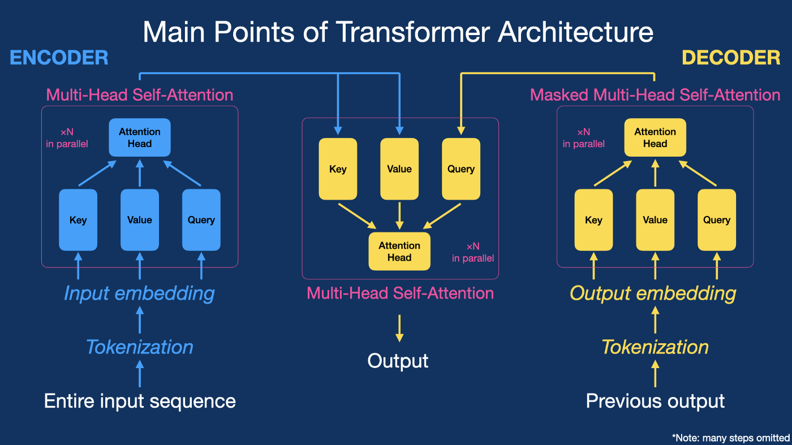

# Tranformer Scratch Implementation In PyTorch

This is the scratch Implementation of the Paper ["Attention All You Need, 2017"](https://arxiv.org/abs/1706.03762).

**Implementation1 - Transformer : [Transformer](tranformer_scratch.py)**

**Implementation2 - Transformer Usecase as Chatbot: [Transformer Chatbot](TransformerChatbot.ipynb)**

**Transformer Architecture**:

## Overview
The base Transformer consists of an encoder and a decoder:

* Encoder:
    * 6 encoder layers
    * Each encoder has 2 sub-layers: (1) multi-head self-attention; (2) feed-forward
* Decoder:
    * 6 decoder layers
    * Each decoder layer has 3 sub-layers: (1) masked multi-head self-attention; (2) encoder-decoder multi-head attention; (3) feed forward

Here’s a one-figure review of multi-head attention, one of the Transformer model’s key innovations:

## Motivation for Transformer?

The main problem with the RNN (LSTM, GRU) is that we have to wait for the processing of the nth input until the (n-1)th input is processed, i.e., there is no possible parallel processing. So, the author of "Attention All You Need" says that we do not need RNN any more, we only need attention. Not sequential like RNNs, all the input (e.g., sentences) is fed once through the model and the calculation is performed once. The Transformer overcomes the main drawback of RNN sequence dependency with no parallel processing, even if we have a GPU, and also provides long-term dependency minimizing the vanishing gradient problem.

