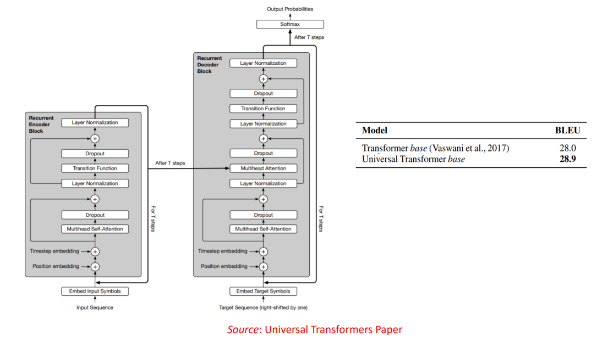
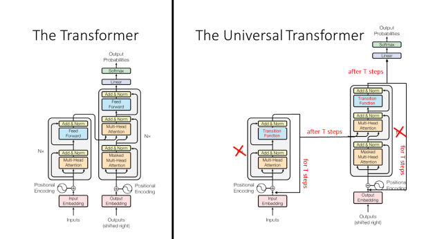

# Universal Tranformer Scratch Implementation In PyTorch

This is the scratch Implementation of the Paper ["Universal Transformers, 2019"](https://arxiv.org/abs/1807.03819). Here I also show how to build chatbot using it.

**Implementation: [Universal Transformer](UniversalTransformer.ipynb)**

### What is Universal Transformer?

The Universal Transformer is a generalization of the Transformer architecture. Universal Transformers combine the parallelizability and global receptive field of feed-forward sequence models like the Transformer with the recurrent inductive bias of RNNs. They also utilise a dynamic per-position halting mechanism.

**Architecture**

### Motivation for the Universal Transformer:
The original Transformer is a natural language processing model that processes all words in the input sequence in parallel, while making use of attention mechanisms to incorporate context. It’s faster to train than an RNN, which has to process input tokens one-by-one. It achieves good performance on language translation. However, it has poorer performance on algorithmic tasks like string copying (e.g. given ‘abc’ as input, output ‘abcabcabc.’)

The Neural GPU and Neural Turing Machine (different kinds of models) have poorer performance on language translation but good performance on algorithmic tasks. The goal of the Universal Transformer is to achieve good performance on both language translation and algorithmic tasks with only one model.

## Universal Transformer vs Transformer:

They key differences between the Transformer and the Universal Transformer are as follows:

1. The Universal Transformer applies the encoder for a variable number of steps for each input token (T steps), while the base Transformer applies exactly 6 encoder layers.

2. The Universal Transformer applies the decoder for a variable number of steps for each output token (T steps), while the base Transformer applies exactly 6 decoder layers.

3. The Universal Transformer uses a slightly different input representation: it includes a “timestep embedding” in addition to the “positional encoding.”

The Universal Transformer is a “parallel-in-time self-attentive recurrent sequence model” which is parallelizable over the input sequence. Like the base Transformer, it has a “global receptive field” (meaning it looks at a lot of words at once.) The main new idea is that in each recurrent step, the Universal Transformer iteratively refines its representations for all symbols in the sequence using self-attention followed by a “transition function” shared across all positions and time-steps.